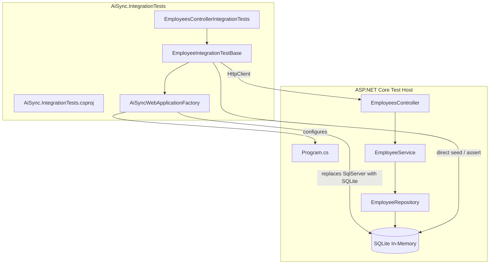
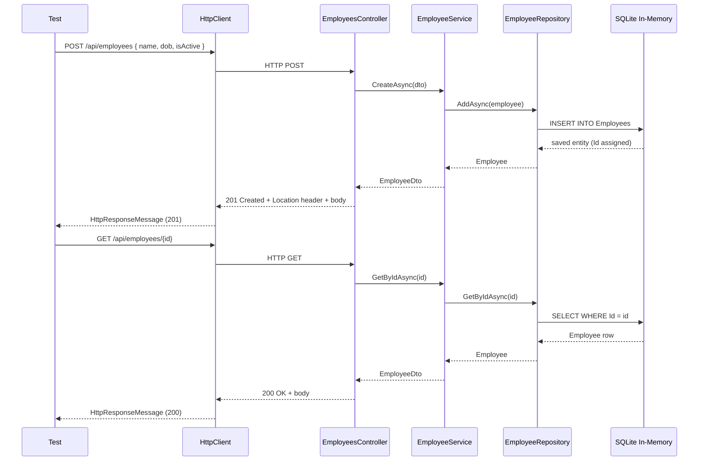
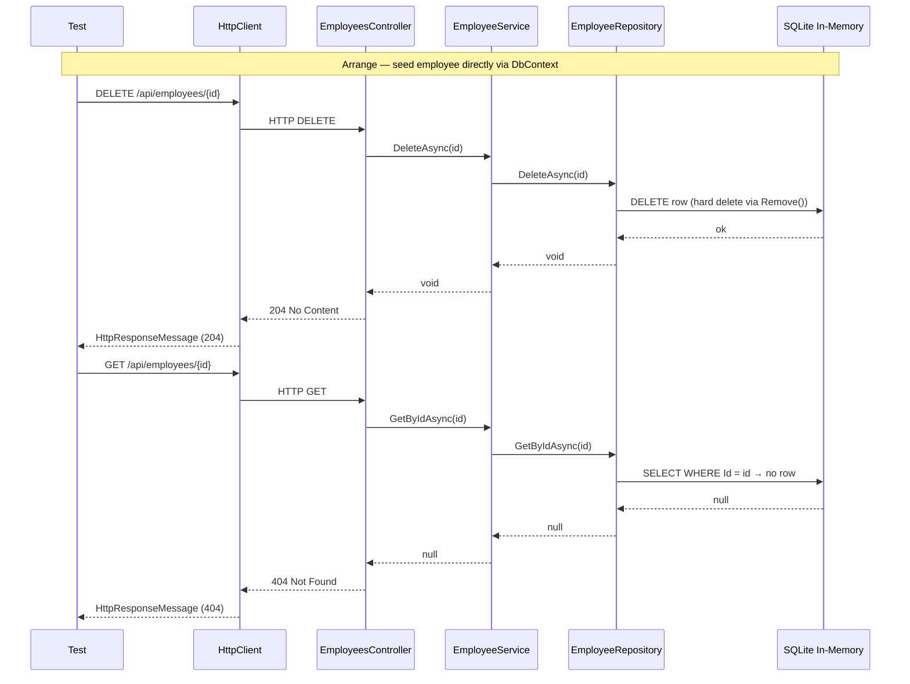

# Design Document: Integration Tests

## Overview

This feature adds an end-to-end integration test suite for the AI-Sync backend. Tests spin up a real `WebApplicationFactory<Program>` instance, replace the SQL Server database with an in-memory SQLite database, and exercise the full HTTP pipeline — controllers → services → repositories → database — for every `EmployeesController` endpoint. The suite lives under `Backend/src/AISync.UnitTests/AiSync.IntegrationTests/` and follows all xUnit conventions already in use.

The integration tests complement the existing unit tests: where unit tests isolate individual classes behind mocks, integration tests assert that all the layers compose correctly and that HTTP status codes, response bodies, and database side-effects match the expected contract.

## Architecture

The test project references `AiSync.API` (which transitively pulls in `AiSync.Application` and `AiSync.Infrastructure`) plus `Microsoft.AspNetCore.Mvc.Testing` and `Microsoft.EntityFrameworkCore.Sqlite`. A custom `WebApplicationFactory` subclass overrides DI registration to swap SQL Server for an in-memory SQLite database and exposes `AppDbContext` for direct seed/assertion access.



## Sequence Diagrams

### Happy-path: POST then GET by ID



### Soft-delete: DELETE then verify IsActive=false



## Components and Interfaces

### Component: AiSyncWebApplicationFactory

**Purpose**: Customises the ASP.NET Core test host to use SQLite in-memory instead of SQL Server, and exposes a scoped `AppDbContext` accessor for test setup and assertions.

**Interface** (C#):
```csharp
public class AiSyncWebApplicationFactory : WebApplicationFactory<Program>
{
    protected override void ConfigureWebHost(IWebHostBuilder builder);
    public AppDbContext CreateDbContext();
}
```

**Responsibilities**:
- Remove the `DbContextOptions<AppDbContext>` descriptor from the DI container.
- Register `AppDbContext` with `UseSqlite("DataSource=:memory:")` using a shared `SqliteConnection` kept open for the lifetime of the factory.
- Expose `CreateDbContext()` so test base classes can seed data or assert final state without going through HTTP.
- Ensure `EnsureCreated()` runs once when the factory is initialised, applying the EF Core model to the in-memory schema.

### Component: EmployeeIntegrationTestBase

**Purpose**: Base class that gives each test class a pre-configured `HttpClient` and helpers to seed employees and clean up between tests.

**Interface** (C#):
```csharp
public abstract class EmployeeIntegrationTestBase : IAsyncLifetime
{
    protected HttpClient Client { get; }
    protected AiSyncWebApplicationFactory Factory { get; }

    public Task InitializeAsync();
    public Task DisposeAsync();
    protected Task<int> SeedEmployeeAsync(string name, DateTime dob, bool isActive = true);
    protected Task<Employee?> FindEmployeeInDbAsync(int id);
}
```

**Responsibilities**:
- Create and hold the `AiSyncWebApplicationFactory` instance.
- Create an `HttpClient` from the factory (`factory.CreateClient()`).
- In `InitializeAsync`: ensure the database is clean before each test.
- In `DisposeAsync`: dispose the `HttpClient` and `factory`.
- `SeedEmployeeAsync`: inserts a row directly via `AppDbContext` and returns the assigned `Id`.
- `FindEmployeeInDbAsync`: queries the database directly to assert side-effects.

### Component: EmployeesControllerIntegrationTests

**Purpose**: xUnit test class covering all `EmployeesController` endpoints.

**Responsibilities**:
- Inherit `EmployeeIntegrationTestBase` so each test gets a fresh database state.
- Group tests by endpoint using nested classes (`GetAll`, `GetById`, `Create`, `Update`, `Delete`).
- Assert HTTP status codes, response body shape/values, `Location` headers, and database side-effects.

## Data Models

### Seed/Request DTOs used in tests

```csharp
// Used to POST a new employee
record CreateEmployeeDto(string Name, DateTime DateOfBirth, bool IsActive = true);

// Used to PUT an existing employee
record UpdateEmployeeDto(string Name, DateTime DateOfBirth, bool IsActive);

// Deserialised from response bodies
record EmployeeDto(int Id, string Name, DateTime DateOfBirth, bool IsActive);
```

### Validation rules exercised by integration tests

- `Name` is required and must be ≤ 200 characters — POST/PUT with an empty or overlong name returns `400 Bad Request`.
- `DateOfBirth` is required — POST/PUT with a missing date returns `400 Bad Request`.
- Referencing a non-existent `Id` on GET/PUT/DELETE returns `404 Not Found`.

## Algorithmic Pseudocode

### Factory Initialisation Algorithm

```pascal
PROCEDURE AiSyncWebApplicationFactory.ConfigureWebHost(builder)
  INPUT: builder — IWebHostBuilder
  OUTPUT: void (side-effects: DI container mutated)

  SEQUENCE
    // Remove production SQL Server registration
    descriptor ← services.FirstOrDefault(
        d => d.ServiceType = typeof(DbContextOptions<AppDbContext>))
    IF descriptor IS NOT NULL THEN
      services.Remove(descriptor)
    END IF

    // Open a shared SQLite connection for the factory lifetime
    connection ← new SqliteConnection("DataSource=:memory:")
    connection.Open()

    // Register SQLite-backed DbContext
    services.AddDbContext<AppDbContext>(options =>
        options.UseSqlite(connection))

    // Ensure schema is created before any test runs
    provider ← services.BuildServiceProvider()
    scope    ← provider.CreateScope()
    context  ← scope.ServiceProvider.GetRequiredService<AppDbContext>()
    context.Database.EnsureCreated()
  END SEQUENCE
END PROCEDURE
```

**Preconditions:**
- `WebApplicationFactory<Program>` is being initialised for the first time.
- `Program` class is accessible (partial class with `internal` visibility or `InternalsVisibleTo` set).

**Postconditions:**
- The DI container contains exactly one `AppDbContext` registration backed by SQLite in-memory.
- The schema is created; all EF Core model tables exist.
- No SQL Server connection is used.

### Test Base Lifecycle Algorithm

```pascal
PROCEDURE EmployeeIntegrationTestBase.InitializeAsync()
  INPUT: (none)
  OUTPUT: Task

  SEQUENCE
    context ← Factory.CreateDbContext()
    context.Employees.RemoveRange(context.Employees)
    context.SaveChanges()
  END SEQUENCE
END PROCEDURE

PROCEDURE EmployeeIntegrationTestBase.SeedEmployeeAsync(name, dob, isActive)
  INPUT: name : String, dob : DateTime, isActive : bool
  OUTPUT: id : int

  SEQUENCE
    context  ← Factory.CreateDbContext()
    employee ← new Employee { Name = name, DateOfBirth = dob, IsActive = isActive }
    context.Employees.Add(employee)
    context.SaveChanges()
    RETURN employee.Id
  END SEQUENCE
END PROCEDURE
```

**Loop Invariants (InitializeAsync):**
- After `RemoveRange` + `SaveChanges`, the `Employees` table contains zero rows.

**Postconditions (SeedEmployeeAsync):**
- The returned `id` is a positive integer assigned by EF Core.
- Exactly one row exists for that `id` in the database.

### HTTP Test Pattern Algorithm

```pascal
PROCEDURE TestHttpEndpoint(method, url, body)
  INPUT:  method : HttpMethod, url : String, body : Object?
  OUTPUT: response : HttpResponseMessage, responseBody : T?

  SEQUENCE
    // Arrange
    request ← new HttpRequestMessage(method, url)
    IF body IS NOT NULL THEN
      request.Content ← JsonContent.Create(body)
    END IF

    // Act
    response ← await Client.SendAsync(request)

    // Assert status code
    Assert.Equal(expectedStatusCode, response.StatusCode)

    // Deserialise body when applicable
    IF response.StatusCode IN [200, 201] THEN
      responseBody ← await response.Content.ReadFromJsonAsync<T>()
      Assert assertionsOn(responseBody)
    END IF
  END SEQUENCE
END PROCEDURE
```

## Key Functions with Formal Specifications

### AiSyncWebApplicationFactory.ConfigureWebHost

```csharp
protected override void ConfigureWebHost(IWebHostBuilder builder)
```

**Preconditions:**
- `builder` is not null.
- `Program` is accessible as the entry-point type.

**Postconditions:**
- `services` contains exactly one `DbContextOptions<AppDbContext>` descriptor backed by `SqliteConnection`.
- `EnsureCreated()` has been called; the SQLite schema matches the EF Core model.
- `SqliteConnection` remains open for the factory lifetime.

**Side-effects:** Opens and holds a `SqliteConnection`; modifies the DI container.

---

### EmployeeIntegrationTestBase.SeedEmployeeAsync

```csharp
protected async Task<int> SeedEmployeeAsync(
    string name,
    DateTime dateOfBirth,
    bool isActive = true,
    CancellationToken cancellationToken = default)
```

**Preconditions:**
- `name` is non-null and length ≤ 200.
- `dateOfBirth` is a valid `DateTime`.

**Postconditions:**
- Returns a positive `int` (`id > 0`).
- Exactly one `Employee` row with the given fields exists in the database at that `id`.

---

### EmployeeIntegrationTestBase.FindEmployeeInDbAsync

```csharp
protected async Task<Employee?> FindEmployeeInDbAsync(
    int id,
    CancellationToken cancellationToken = default)
```

**Preconditions:**
- `id` is a positive integer.

**Postconditions:**
- Returns the `Employee` entity if a row with `Id == id` exists; otherwise `null`.
- Does not modify the database.

## Example Usage

```csharp
// ─── Example 1: POST creates employee, GET by ID returns it ───────────────────
public class CreateTests : EmployeeIntegrationTestBase
{
    [Fact]
    public async Task Post_ValidPayload_Returns201AndPersistsEmployee()
    {
        var dto = new { Name = "Alice", DateOfBirth = new DateTime(1990, 6, 15), IsActive = true };

        var response = await Client.PostAsJsonAsync("/api/employees", dto);

        Assert.Equal(HttpStatusCode.Created, response.StatusCode);

        var created = await response.Content.ReadFromJsonAsync<EmployeeDto>();
        Assert.NotNull(created);
        Assert.True(created.Id > 0);
        Assert.Equal("Alice", created.Name);

        // Verify persisted in DB
        var inDb = await FindEmployeeInDbAsync(created.Id);
        Assert.NotNull(inDb);
        Assert.Equal("Alice", inDb.Name);
    }
}

// ─── Example 2: DELETE removes employee, subsequent GET returns 404 ───────────
public class DeleteTests : EmployeeIntegrationTestBase
{
    [Fact]
    public async Task Delete_ExistingEmployee_Returns204AndIsGoneFromDb()
    {
        var id = await SeedEmployeeAsync("Bob", new DateTime(1985, 3, 10));

        var deleteResponse = await Client.DeleteAsync($"/api/employees/{id}");
        Assert.Equal(HttpStatusCode.NoContent, deleteResponse.StatusCode);

        var getResponse = await Client.GetAsync($"/api/employees/{id}");
        Assert.Equal(HttpStatusCode.NotFound, getResponse.StatusCode);
    }
}

// ─── Example 3: GET all returns only active employees (verify IsActive filter) ─
public class GetAllTests : EmployeeIntegrationTestBase
{
    [Fact]
    public async Task GetAll_ReturnsAllEmployeesIncludingInactive()
    {
        await SeedEmployeeAsync("Alice", new DateTime(1990, 1, 1), isActive: true);
        await SeedEmployeeAsync("Bob",   new DateTime(1985, 1, 1), isActive: false);

        var response = await Client.GetAsync("/api/employees");
        Assert.Equal(HttpStatusCode.OK, response.StatusCode);

        var list = await response.Content.ReadFromJsonAsync<List<EmployeeDto>>();
        Assert.NotNull(list);
        Assert.Equal(2, list.Count);
    }
}
```

## Correctness Properties

### Property 1: POST returns 201 with matching body

For all valid `CreateEmployeeDto` payloads, `POST /api/employees` returns `201 Created` with a body whose `Id > 0` and whose `Name`, `DateOfBirth`, and `IsActive` match the request.

### Property 2: Created employee is retrievable by ID

For all `id` returned by a successful `POST`, `GET /api/employees/{id}` returns `200 OK` with a body identical to the `POST` response body.

### Property 3: Non-existent ID returns 404

For all `id` not present in the database, `GET /api/employees/{id}`, `PUT /api/employees/{id}`, and `DELETE /api/employees/{id}` all return `404 Not Found`.

### Property 4: PUT updates all fields in the database

For all valid `UpdateEmployeeDto` payloads applied to an existing `id`, `PUT /api/employees/{id}` returns `200 OK` with fields matching the request, and the database row reflects those updated values.

### Property 5: DELETE removes the row

For all existing `id`, `DELETE /api/employees/{id}` returns `204 No Content` and the row is removed from the database (subsequent `GET` by that `id` returns `404`).

### Property 6: GET all count equals row count

`GET /api/employees` always returns `200 OK` with an array whose length equals the number of rows in the `Employees` table.

### Property 7: Invalid payloads return 400

`POST /api/employees` with an empty `Name`, a `Name` longer than 200 characters, or a missing `DateOfBirth` returns `400 Bad Request`.

## Error Handling

### Error Scenario 1: Employee Not Found (GET / PUT / DELETE)

**Condition**: The `id` path parameter does not correspond to any row in the database.  
**Response**: `404 Not Found` with an empty body.  
**Recovery**: No state change; the database is unaffected.

### Error Scenario 2: Validation Failure (POST / PUT)

**Condition**: The request body fails model validation (missing `Name`, `Name` > 200 chars, missing `DateOfBirth`).  
**Response**: `400 Bad Request` with ASP.NET Core's default `ValidationProblemDetails` body.  
**Recovery**: No state change; no entity is persisted.

### Error Scenario 3: Test Database Isolation Failure

**Condition**: A test leaks state into the shared SQLite database, causing interference with subsequent tests.  
**Response**: Tests fail with unexpected row counts or stale data.  
**Recovery**: `EmployeeIntegrationTestBase.InitializeAsync` truncates the `Employees` table before every test, ensuring each test starts from an empty state.

## Testing Strategy

### Unit Testing Approach

Unit tests already cover each layer in isolation using Moq. Integration tests do not duplicate those — they focus on cross-layer correctness and HTTP contract verification.

### Integration Testing Approach

Each test class inherits `EmployeeIntegrationTestBase : IAsyncLifetime`:
- `InitializeAsync` truncates the database before the test runs.
- `DisposeAsync` disposes the client and factory after the test.

Test classes are organised per endpoint group:

| Class | Endpoint |
|---|---|
| `EmployeesGetAllIntegrationTests` | `GET /api/employees` |
| `EmployeesGetByIdIntegrationTests` | `GET /api/employees/{id}` |
| `EmployeesCreateIntegrationTests` | `POST /api/employees` |
| `EmployeesUpdateIntegrationTests` | `PUT /api/employees/{id}` |
| `EmployeesDeleteIntegrationTests` | `DELETE /api/employees/{id}` |

### Property-Based Testing Approach

Not in scope for this initial suite. Standard example-based tests are sufficient to verify the HTTP contract. Property-based tests could be added in a follow-up if needed.

### Test Coverage Goals

- All 5 controller actions covered with at least one happy-path and one error-path test each.
- `400 Bad Request` validation scenarios for `POST` and `PUT`.
- Location header on `POST 201` asserts the correct round-trip URL.

## Performance Considerations

SQLite in-memory is fast; test isolation via table truncation (not per-test database recreate) keeps the suite quick. `WebApplicationFactory` is instantiated once per test class (via `IAsyncLifetime`), amortising startup overhead.

## Security Considerations

No authentication/authorisation is in place on the API, so none is needed in the test host. If auth is added later, the factory's `ConfigureWebHost` can add test-specific token bypass middleware.

## Dependencies

| Package | Version | Purpose |
|---|---|---|
| `Microsoft.AspNetCore.Mvc.Testing` | 10.0.x | `WebApplicationFactory<Program>`, `CreateClient()` |
| `Microsoft.EntityFrameworkCore.Sqlite` | 10.0.x | In-memory SQLite provider for tests |
| `Microsoft.Data.Sqlite` | 10.0.x | `SqliteConnection` for shared in-memory DB |
| `xunit` | 2.9.3 | Test framework (matches existing projects) |
| `xunit.runner.visualstudio` | 3.1.4 | VS test runner integration |
| `Microsoft.NET.Test.Sdk` | 17.14.1 | dotnet test infrastructure |
| `coverlet.collector` | 6.0.4 | Code coverage collection |

**Project references:**
- `AiSync.API` — pulls in the full application stack transitively.

**Program.cs accessibility note:**  
`WebApplicationFactory<Program>` requires `Program` to be accessible. A `public partial class Program {}` declaration must be added at the bottom of `Program.cs`, or `<InternalsVisibleTo>` set in `AiSync.API.csproj`.
